# Player Statistics
Adds a command to your Fabric server that gives players insights into everyone's statistics.
Let them boast and compete for the most meaningless statistics there are!

## Installation
Download this mod along with its dependencies and put them in your server's mods folder.
There is **no additional setup required**, regardless of how long your server's world has existed!
When starting the server with this mod for the first time, a database will be initialized using existing player statistics files.

> [!NOTE]
> 

> 
Fetching player names

> Player names are initially obtained through the user cache (the <code>usercache.json</code> file in the server folder).
> This means that only the most recently used (by default) 1,000 player names can be inserted into the database on initialization.
> Missing player names will be updated when the affected players rejoin your server.
> 

## Features
Thanks to database queries, data can be retrieved lightning fast! Additionally, all queries are run **asynchronously**
to ensure that any impact on server performance is kept to a bare minimum.

### Tab-completion
All commands come with a complete suggestion list, allowing you to intuitively find and explore
even the most specific statistics you can think of!

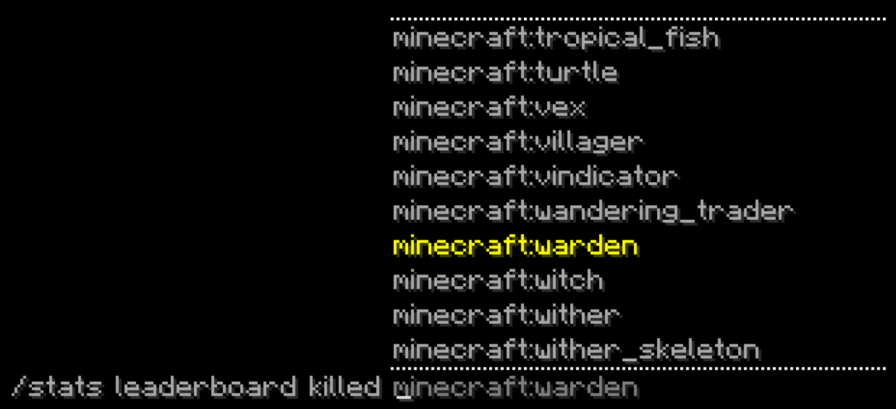

### Leaderboard
The `/stats leaderboard` command generates a leaderboard of all players for a statistic:

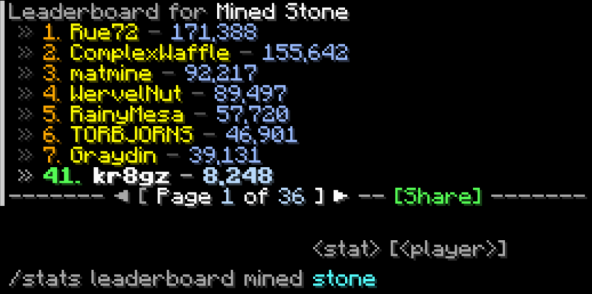

You can change which player is highlighted either by clicking their name on the leaderboard,
or by adding their name to the end of the command arguments:

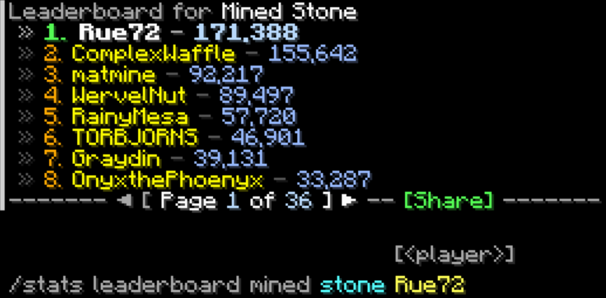

### Server-wide total
The `/stats total` command works similarly to the [`/stats leaderboard`](#leaderboard) command.
But rather than individually displaying each player's value, it shows the sum of all players on the server,
along with how much the highlighted player has contributed:

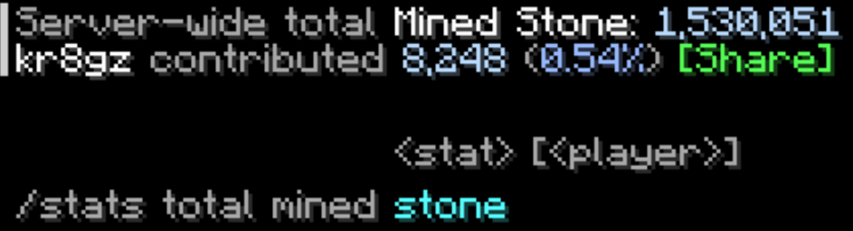

### Top statistics per player
Using the `/stats top` command, you can see which statistics you (or any other player you wish to highlight) rank highest in!

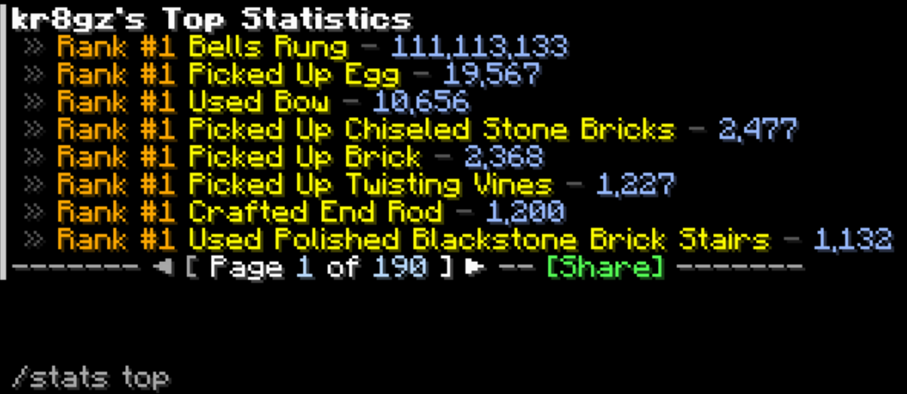

Clicking on any statistic name will suggest a command to show the leaderboard for that statistic:

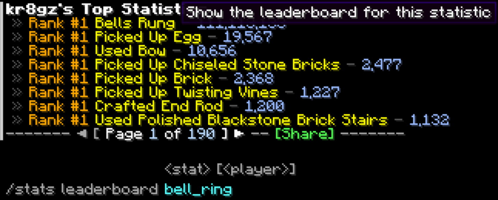

### Pagination
In addition to clicking the arrow buttons at the bottom, you can use `/stats page`
to quickly jump between pages (using the command output above as an example):

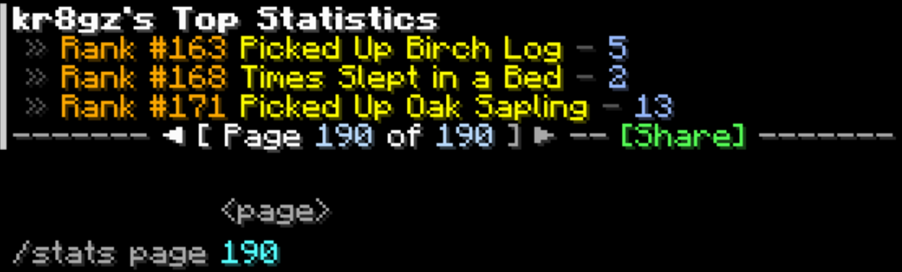

### Sharing
You can share the exact output you're looking at either by clicking the green `[Share]` button, or by running `/stats share`.
Other players will be able to see what you shared by hovering over the green `[Hover]` text:

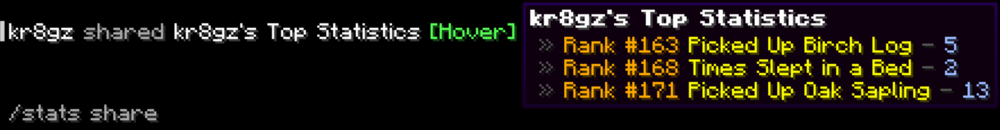

> [!TIP]
> 

> 
Advanced usage examples

> 
> ### Precise values
> Hovering over certain types of values will show them in more precise units:
> 
> 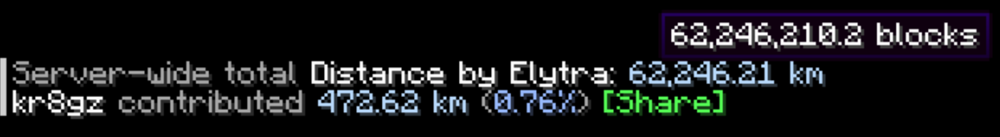
> 
> ### Random statistics
> Instead of specifying a statistic, you can also let the mod choose one for you:
> 
> 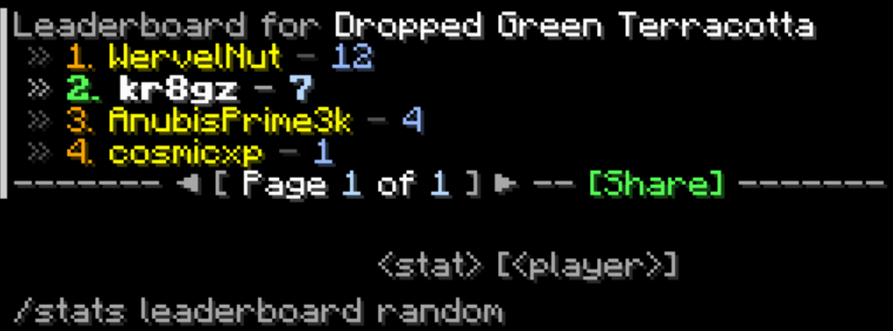
> 
> ### Remove highlight
> You can create command output without any highlight by specifying a non-existent player name, such as `-`:
> 
> 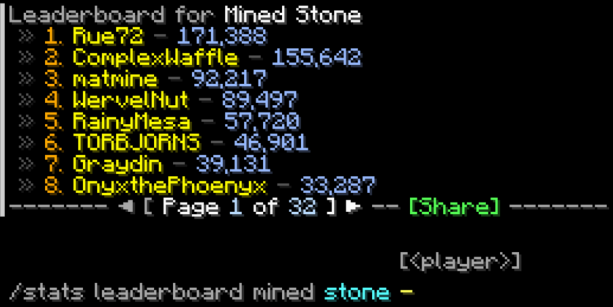
> 

### Configuration and customization
When you launch your server, a configuration file will be generated at
[`config/PlayerStatistics.toml`](src/main/resources/config.toml).
The file contains comments with additional information on individual settings to guide you through all available options.

> [!TIP]
> If your configuration file contains errors that you cannot fix,
> you can also delete it to let it regenerate from the template.

### Localization
Server-side translations are provided for all elements of this mod &mdash;
the following output is entirely in German, for example:

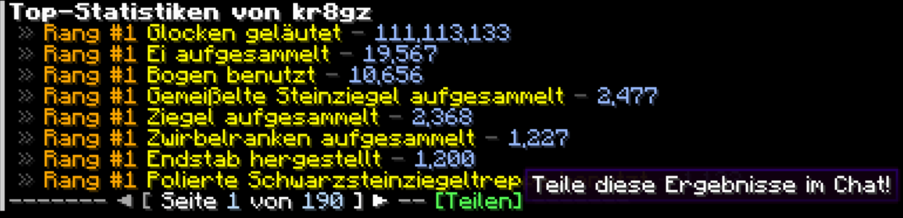

If you can, please consider contributing translations in your preferred language!
